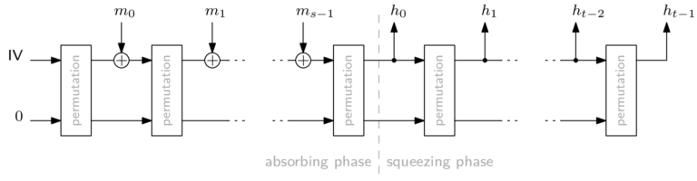
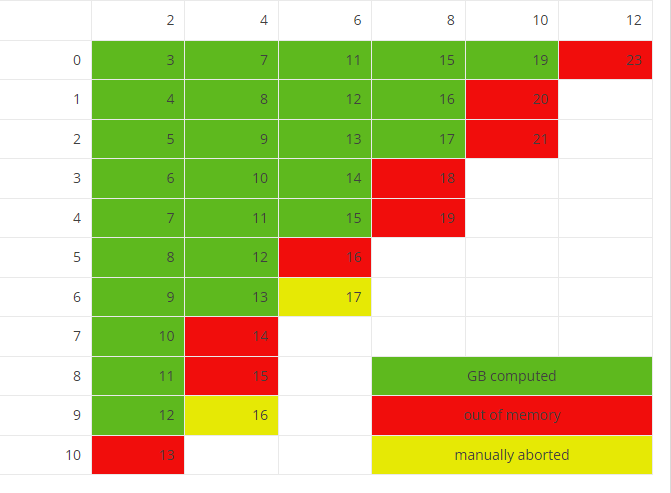

# Gröbner Basis-Attacking a Tiny Sponge 对一些Tiny Sponge的GB 攻击

在评估密码或哈希函数的安全性时，需要考虑许多不同的攻击场景。 对于面向算术的密码 (AOC)，Gröbner 基础攻击比对“传统”密码（如 AES）更具威胁性。 证明对 `Gröbner` 基攻击的抵抗力的最常见方法是查看 `Gröbner` 基算法的预期复杂性。

然而，复杂度估计只能渐进地应用，大 $\mathcal{O}$ 表示法可能隐藏了密码设计者感兴趣的对参数大小重要的因素。因此，为了验证理论复杂度估计是否有意义，我们需要“真实”数据来比较 它到。 这意味着运行实验——这正是这篇文章的主题。 具体来说，我们已经执行了几次 `Gröbner` 基础攻击，并将在这里讨论和解释结果数据。

## 实验说明
`Rescue-Prime` 和 `Poseidon` 等 AOC 被设计为具有“小”代数描述。 也就是说，在对它们的结构进行多项式建模时，我们不需要太多的多项式，而且这些多项式的次数也不是很高。

AOC 的简单代数描述导致主要加速的用例涉及零知识证明系统中的哈希。 将 `Rescue-Prime` 或 `Poseidon` 等排列转换为哈希函数的最流行方法是 Sponge 构造。 在高层次上，海绵看起来像这样：

任何加密散列函数都需要防止反转，即，为给定的散列摘要计算原像必须非常困难以至于不可行。 对于 Sponge 构造，这在很大程度上取决于插入排列。 对于我们的实验，我们对 Sponge 结构执行第二次原像 Gröbner 基础攻击，并恰好使用一次排列。

此外，我们设 $rate=1,capacity=1$
，这是任一参数的最低有意义值。 这样，我们就得到了可以构建的最小的 Sponge。 因此，如果这种攻击是不可行的，那么 Gröbner 基础攻击实际大小的海绵肯定是可行的。

作为排列，我们使用具有不同回合数的 `Rescue-Prime` 和 `Poseidon` 这两个原语。 质数域有大小为 $p=65521$，这是其中最大的 16 位素数
，意味着我们可以使用指数$gcd(p-1,3)=1$在 S-Boxes 中对 16 位素数的限制来自使用的 Gröbner 基础计算实现，即 FGb [2]。

## 计算配置
所有实验均使用 cocalc 在“n2-highmem-32 Cascade Lake Google Compute Engine”和 free 报告的 264141536 KiB（~252 GiB）总 RAM 上进行。 使用的操作系统是 (Ubuntu) Linux 5.4.0-1042-gcp x86_64，由 uname -srm 报告。

## 总结
在更详细地查看数据之前，这里是我的一些发现的快速总结。

- 我们设法计算了 6 轮 Rescue-Prime 的 Gröbner 基，但在 7 轮时失败了。
- 波塞冬有两种类型的回合，这使得关于回合限制的争论更加麻烦。 除了一个异常值外，我们无法打破总共 11 轮的任何分区——请参见下面的矩阵。
- 内存，而不是时间，似乎是最大的限制因素。
- 与作者的隐含假设相反，波塞冬的多项式系统似乎是不规则的。 这直接影响推荐轮数。 例如，虽然 Poseidon 的作者推荐 $(8,9)$ 回合 $p=65521$和 $|state|=2$, 在这里推断数据表明,$(8,24)$ 回合可能是必要的。
- Rescue-Prime 的规律性插值与 Rescue 发布的插值不同，但原理相似。 这种差异可以通过使用 Rescue-Prime 作为排列来解释。 可悲的是，它既没有证实也没有反驳作者的说法。

## 结论细节
像上面描述的那样的实验产生了大量的数据。 我们不会在这里查看所有内容，我只想强调一些部分。 如果您想开始更深入地挖掘，可以在本文末尾找到原始数据。

通常用于估计 Gröbner 基计算复杂性的度量在很大程度上取决于规律性程度。3这并非基于完全严谨的论点，但在实践中似乎“足够好”。 因此，以下内容将有相当一部分是关于正则度和麦考利界的。麦考利界是正则度的上限，如果多项式系统是正则序列，则它们的值是一致的。

总的来说，这两个原语花费时间最长的成功攻击是 6 轮 Rescue-Prime 和（full=2，partial=9）轮 Poseidon。 他们花了大约 34 和 73 小时，分别需要大约 75 和 228 GiB。

## Rescue-Prime

我们成功计算了 6 轮 Rescue-Prime 的 Gröbner 基，但在计算 7 轮 Rescue-Prime 时内存不足。

### 正则度
要考虑的最重要指标是规律性程度的增长作为轮数的函数。 正如我们所看到的，正则度都要比 Rescue-Prime 系统的麦考利界限小 $2$。 唯一的例外发生在
第二轮，我认为这种异常现象不值得引起太多关注。

有趣的是，在生成的 reducer Gröbner 基中最高阶多项式的次数——缩写为 Gröbner 基的次数——甚至比它还低。 但更重要的是，它的增长似乎只是分段线性的：在 1 到 4 轮之间，Gröbner 基的阶数增长了 $3$ 每次迭代，从第 4 轮开始，差异是 $4$. 数据点数量有限，很难得出结论。 然而，有理由认为线性外推 Gröbner 基的次数可能会导致不准确。 **同样，外推正则度是否是估计计算全轮原语 Gröbner 基的复杂性的好方法仍然是一个悬而未决的问题。**

在 Rescue-Prime 中观察到的规律性程度的增长与“普通”Rescue 出版物中报道的不同。因此，观察到 $d_{reg}\approx 4r-1$，但是Rescue-prime 的作者声称 $d_{reg}=2r+2$。下图是比较

将这种规律性程度的插值扩展为外推，可用于估计达到给定安全级别所需的轮数。 为此，我们使用已知的复杂性边界来获得最高性能的 Gröbner 基础算法 
$$
\binom{n+d_{reg}}{n}^\omega
$$
其中 $n$ 是变量个数， $d_{reg}$ 是正则度

据我所知，虽然没有使用稀疏线性代数技术的 Gröbner 基算法的实现，但它们可能存在，或者它们将在未来某个时间点存在。 对于 Rescue-Prime 使用的参数，变量的数量等于方程的数量，是 $2r$。正则度评估是 $4r-1$，那么计算得到 最高性能的 Gröbner时间复杂度为 
$$
\binom{6r-1}{2r}^2>2^{128},r\ge 13
$$
对于相同的参数，Rescue-Prime 的作者推荐 $r= 27$
[4，算法 7]。 此建议还包括安全裕度，并考虑了比 Gröbner 基础攻击更的攻击向量。

###  攻击过程的次数增长

F4 的工作次数严格单调递增：F4 主循环的每次迭代都意味着精确地使用次数多项式比上次迭代高 $1$。 这是一个相当沉闷的数字：

## Poseidon

由于波塞冬有两种类型的回合，即完整回合和部分回合，我们对波塞冬进行了比救援更多的实验。 下面的矩阵总结了我们运行了哪些，以及是否可以成功计算 Gröbner 基。 单元格的值表示多项式系统有多少个多项式。 这等于此问题实例的多项式环中的变量数。 完整轮次的数量因列而异，部分轮数因行而异。

总共 $11$ 回合似乎是我们无法用可用机器打破的障碍，$(2,9)$-实例是一个明显的例外。 请注意，方程的数量似乎不是截止点——对于 $(2,10)$-Poseidon，我们有 $13$ 个方程和变量但无法计算 Gröbner 基，而对于 $(10,0)$-Poseidon 及其 $19$ 个方程， 我们可以计算 Gröbner 基。 对于下面的一些数字，我们查看系列更详细的完整回合以简化演示。

### 正则度
和以前一样，正则度是我们最感兴趣的指标。 例如，对于 Poseidon (4,·)，即 4 个完整轮次和不同数量的部分轮次，我们在绘制麦考利界和系统的正则化程度时得到下图。

看起来正则度的增长速度低于麦考利界限。 为了获得更完整的图片，下表列出了所有成功计算的 Gröbner 基的正则度。 灰色值表示 Gröbner 基础计算没有终止，但在内存耗尽或被手动中止之前达到了指示的最大值。

我们可以计算由以下各项产生的多项式系统的麦考利界 从 $(r_{full},r_{partial})$,Poseidon 是 $4r_{full}+2r_{part}-1$ 。基于上述数据的规律性程度的紧密拟合线性近似是 $d_{reg}\approx \frac{r_{full}}{2}+r_{part}+2$ 。（有限的）数据表明，正则性对整轮的依赖程度远低于麦考利界限所表现的那样。 总的来说，正则度并没有非常接近麦考利界限。

根据 Poseidon 作者提供的脚本，使用状态大小 2 时，128 位安全性的推荐轮数为 $(8,9)$。使用完整轮数作为给定，并插入正则度 $r+6$ ，变量个数为 $r+15$ 进入性能最高的 Gröbner 基算法的复杂性界限，我们得出的结论是 $r\ge 24$  部分回合是实现 128 位安全性以防止 Gröbner 基础攻击所必需的，$\binom{2r+21}{r+15}^2>2^{128}$ 对于 $r\ge 24$ 。这种差异是观察到的规律性程度不等于麦考利界限的直接结果——将麦考利界限代入相同的公式会导致 $r\ge 10$。

### F4’s working degree

F4 的工作度对于 Poseidon 派生的多项式系统来说是相当“有弹性”的。 例如，对于 $r_{full}=4$ 具有不同数量的部分轮，我们可以绘制 F4 的工作度与该度发生的迭代的关系。虽然总体趋势是“向上”，但有许多迭代 工作度没有变化，甚至下降。 我不确定这在安全方面究竟意味着什么，或者它是否意味着什么。

## Comparison between Rescue-Prime and Poseidon

`Rescue-Prime` 和 `Poseidon` 的多项式系统之间最显着的差异之一是它们各自规律性程度的增长率。 例如，考虑下面的图，我从上面重复了 `Rescue-Prime` 的数据，并添加了 (·,0)-Poseidon 的麦考利界限和正则度，即，改变完整回合的次数。

虽然麦考利界限几乎相同，但观察到的正则度异很大。

也很高兴看到几个实例的已用内存的发展，尽管这种比较不是很重要。 下图显示了第 5、6 和 7 轮 Rescue-Prime 以及 (4,5)、(4,6)、(4,7) 轮 Poseidon 随时间推移所需的内存。 其中最小的一个 回想一下，7 轮 Rescue-Prime 和 (4,7) 轮 Poseidon 都耗尽了内存，即异常终止。

通过内存消耗的跳跃，您可以非常清楚地看到在哪里构建了一个新的、更大的矩阵。 这对应于 F4 的迭代。 指数 - 或二项式 - 增长就是这样，绘制轮次较少的实例是没有意义的。 在图的左下角几乎看不到 5 发 Rescue-Prime 和 (4,5) 发 Poseidon。 虚线对应于总可用内存。

## 结论
数据表明，关于波塞冬多项式系统规律性的隐含假设是错误的：麦考利界限与观察到的正则度之间的差异意味着系统是不规则的。 这对达到目标安全级别所需的最少轮数有直接影响。例如，对于 $p=65519$ 状态大小为2，我们将推荐 (8,24) 轮而不是(8,9) 回合。

一个有趣的开放性问题是在计算 Poseidon 派生系统的 Gröbner 基时如何解释 F4 工作度的“弹性”。 这种行为的意义完全不清楚。

另一个悬而未决的问题是关于观察到的 Rescue 和 Rescue-Prime 正则度增长的差异。 无论如何，数据支持 Rescue-Prime 的安全论点：在两端增加半轮，即，将“普通”Rescue 转换为 Rescue-Prime，似乎不会降低安全性。

综上所述，对于任何接近现实整数的事物，都无法成功执行 Gröbner 基础攻击——即使是对于这种微小的 Sponge 结构。