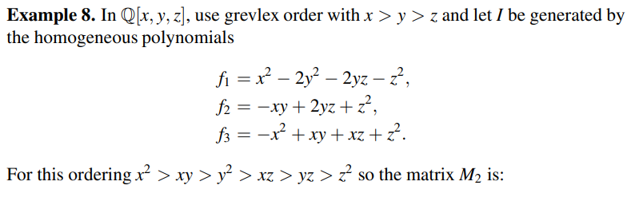
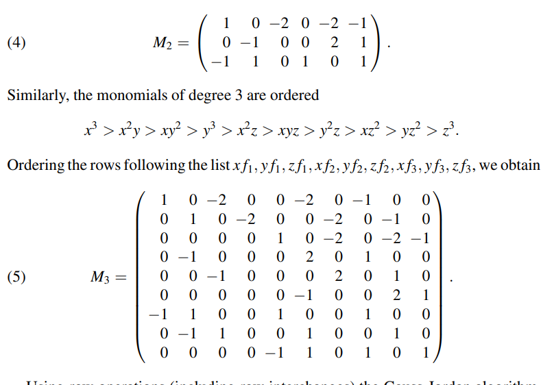
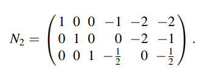

# Additional Gröbner Basis Algorithms

## Preliminaries

### 齐次GB
齐次理想的 Gröbner 基的计算有许多特殊特征，这些特征提供了简化和捷径的机会。 事实上，为了利用这些捷径，一些用于这些计算的第一代计算机代数系统，包括拜耳和斯蒂尔曼开发的原始麦考利程序，只接受齐次输入。

我们在第 8 章中研究了齐次多项式和理想，其中第 3 节的定理 2 建立了这些陈述的等价性：

- $I\subseteq k[x_1,...,x_n]$ 是一个齐次理想 .
- $I=<f_1,...,f_s>$ ，其中 $f_i$ 是一个齐次多项式 .
- 关于任何单项式排序的 $I$ 的唯一简化 Gröbner 基由齐次多项式组成 .

在本章中，非零多项式的代数次数记为 $deg(f)$ 。我们将次数为 $m$ 的多项式的向量空间记为 $k[x_1,...,x_n]_m$ 。 根据定义，零多项式作为加法单位元包含在两个向量空间中。

从第 8 章第 3 节的练习 3 中，我们知道在应用 Buchberger 算法从齐次输入多项式计算 Gröbner 基时，

- 由算法生成的所有的非零 S-多项式 都是齐次的
- S-多项式的所有非零剩余都是齐次的

接下来我们将研究如何使用齐次来组织计算参与 Buchberger 的算法。
首先，先介绍一些平凡的概念

**定义1 .** $G=(f_1,...,f_t)$ 是一个排序后的齐次多项式集合。多项式对 $(i,j)$ 的**代数次数**为 $deg(lcm(LM(f_i),LM(f_j)))$

举个例子：如果我们定义单项式序为 grevlex $x>y>z$ 在 $\mathbb{Q}[x,y,z]$ 上，并且 
$$
% \begin{equation}
\begin{align}
f_1=x^2 − 2y^2 − 2yz − z^2 \\
f_2=-xy+2yz+z^2\\
f_3=-x^2+xy+xz+z^2
\end{align}
% \end{equation} 
$$
其中多项式对 $(1,2)$ 次数为 $3$ 因为 $lcm(LM(f_1),LM(f_2))=x^2y$。

如果 $f_i$ 们是齐次的，那么很容易看出 多项式对 $(i,j)$ 和S-多项式 $S(f_i,f_j)$ 的次数是一致的还有 剩余多项式 $\overline{S(f_i,f_j)}^G$ 。

**Proposition 2.** 在Buchberger 算法中，输入是齐次多项式；当一个新的多项式 $f_i$ 被加入未完全 GB $G$ 中时，所有的多项式对 $(i,t),i<t$ 的次数严格大于等于 $deg(f_i)$.

**证明：** 假设多项式 $f_t$ 的代数次数为 $deg(f_t)=m$。因为 $f_t$ 是齐次多项式，那么我们考虑多项式对 $(i,t),i<t$。那么多项式对 $(i,t)$ 的代数次数为 $deg(lcm(LM(f_i),LM(f_t)))$，很明显这个 次数是一定要大于等于 $m$ 的。

现在我们假设多项式对 $(i,t)$ 的代数次数等于 $m$ ，因为 $deg(LM(f_t))=m$，所以 $lcm(LM(f_i),LM(f_t))=LM(f_t)$ 并且 $LM(f_i)|LM(f_t)$。**但是，这是矛盾的，因为 $f_t$ 是经过所有 $f_i$ 约简得到的剩余，因此多项式对 $(i,t)$ 的次数要严格大于 $m$**.

### Gröbner Basis Algorithms and Linear Algebra

接下来我们将看到，在某种意义上，S 多项式余数计算可以被以不同方式产生相同信息的计算所取代。 所涉及的新想法是将多项式代数转换为线性代数 [参见 LAZARD (1983) 以获得更全面的联系说明]。 这在齐次情况下尤其明显，因此我们将再次假设 I 是齐次理想。通常，我们将次数为 $m$ 的齐次多项式向量空间记为 $I_m=I\cap k[x_1,...,x_n]_m$。

**Lemma 7.** $I=<f_1,...,f_s>$ ，其中多项式 $f_i$ 是齐次的。$m\in \mathbb{Z}_{\ge 0}$。那么 $I_m$ 中的每个元素都是多项式 $x^{\alpha}f_i$ ，其中 $|\alpha|+deg(f_i)=m$，的线性组合。

令 $S_m$ 是所有多项式 $(\alpha ,i)$ 的集合，我们固定单项式序，令 $T_m$ 是所有 单项式 $x^{\beta},|\beta|=m$ 的集合，降序排列。我们可以构建一个 $|S_m|\times |T_m|$ 的矩阵 $M_m$ ，其中每一项都是 $T_m$ 中的单项式在 $S_m$ 中的多项式中的系数。

&#x1F600;举个例子：

我们对 $M_2$ 进行化简，化简为行阶梯形矩阵，我们得到 

我们令得到的三个新的多项式为 $g_1,g_2,g_3$,我们发现在 $N_2$ 的最后一行的多项式首项是 $LM(g_3)=y^2$ ，这不在最初的多项式集合首项构成的理想中，也就是 $y^2\in <LM(f_1),LM(f_2),LM(f_3)>=<x^2,xy>$，所以通过对多项式的线性组合产生了新的多项式首项，我们发现 $g_3$ 就是 $\overline{S(f_1,f_3)}^F$ 。所以 $g_3$ 可以加入构成 GB 的一部分。

**Proposition 10.** $f_1,...,f_s$ 都是齐次多项式，并且它们生成了 理想 $I$ 。$g_1,...,g_t$ 为约简为行阶梯形后得到的多项式。如果 $g\in I_m$ 是任意的非零多项式，那么 $LM(g)$= $LM(g_i),1\le i\le t$。

**证明：** 

## Hilbert Driven Buchberger Algorithms

浅红色文字：  
&#x1F600;
✔️
&#x1f602;

