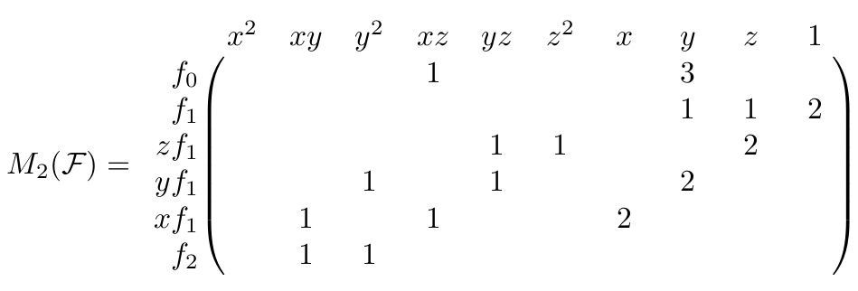
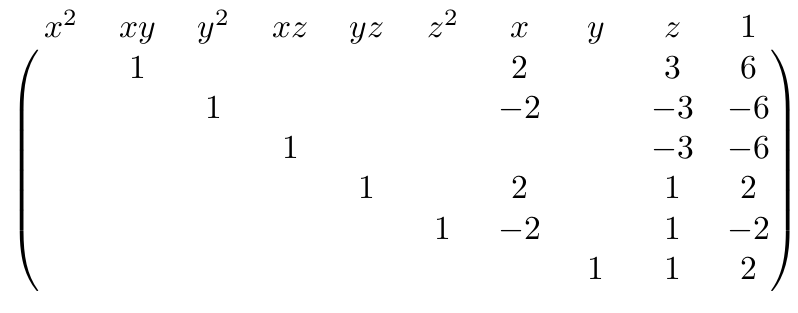
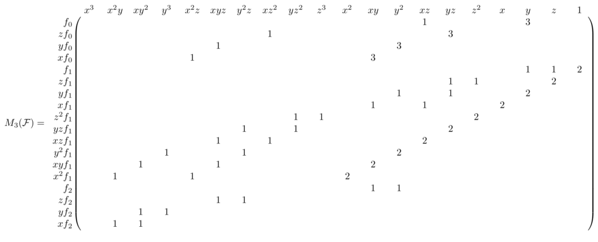
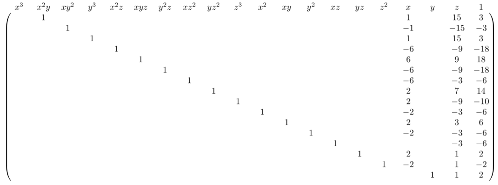

# The Degree of Regularity – Intuition using Linear Algebra

## Why bother with Gröbner bases?

任何密码原语——密码、散列函数等——都可以通过多元多项式方程表示。 求解这些方程的有效方法同时打破了底层原语。 `Gröbner` 基是同时求解多个多元多项式方程的好方法。 有关这方面的更多详细信息，请查看我们之前关于 `Gröbner` 基础攻击的帖子。

设计密码原语的人必须展示或令人信服地论证对任何适用攻击向量的弹性，其中之一是 `Gröbner` 基础攻击。 在宇宙热寂之前实际计算特定系统的 `Gröbner` 基是否切实可行取决于许多因素。 原语的设计者需要证明或论证从他们的原语派生的所有系统都不是“简单的”。

## 什么是正则degree
从多项式系统计算 `Gröbner` 基**通常很难**——但在完成计算之前很难知道究竟有多难。 **多项式系统的规律性程度是一个可以推导出复杂性上限的值**。 具体来说，计算一个 多项式系统 $\mathcal{F}$ 的`Gröbner` 在多项式环 $R[x_0,...,x_{n-1}]$ 上 复杂度为
$$
O\left(\binom{n+d_{reg}}{n}^\omega\right)
$$
其中 $\omega$ 是矩阵乘法中的参数。

## 直观的理解

我将使用一个例子直观地推断出规律性程度的一种可能推导。 你可以在这篇文章的底部找到一些独立的 sagemath 代码，实现这个例子。 该代码足够通用，您可以使用任何您想要的环和多项式系统，我鼓励您尝试使用它。 请注意，编写代码是为了可读性，而不是为了性能； 如果您想认真计算 `Gröbner` 基础，请尝试 `sagemath` 的 `groebner_basis()` 函数，或使用更专业的工具。

### 多项式系统

$$
\mathcal{F}=\{xz+3y,y+z+2,xy+y^2\}
$$
定义在多项式环 $\mathbb{F}_{101}[x,y,z]$ 上。那么为了找到 $\mathcal{F}$ 的正则 degree，我们讲计算其 `Gröbner  basis`. 

一种相当低效但有见地的计算 Gröbner 基的方法是将 $\mathcal{F}$ 的麦考利矩阵三角化到足够高的degree。 事实上，最小的degree足够高，恰恰是正则的degree。 但首先，让我们将多项式转换为向量。

### 多项式向量
那 $f=xz+3y$ 作为例子，多项式 $f$ 的degree 是 $2$ 。在三个变量中所有可能的 $2$ 次单项式有 
$$
m=(x^2，xy,y^2,xz,yz,z^2,x,y,z,1)
$$
那么多项式 $f$ 可以表示为 $\boldsymbol{a}\cdot m^{T},a=(0,0,0,1,0,0,0,3,0,0)$. 其中向量 $a$ 中的系数都是定义在有限域 $\mathbb{F}_{101}$ 上的，这使我们能够执行线性代数运算，为此存在快速的技术和工具。

### 麦考利矩阵

$d$ 次的麦考利矩阵包含 $\mathcal{F}$ 的元素的所有单项式倍数，使得任何此类乘积的次数不大于 $d$。 更正式地说，我们执行以下步骤。

```python
M = ∅
for each polynomial f in F:
    for each monomial m with deg(m) ≤ d - deg(f):
        v = poly_to_vec(m·f)        // pad with zeros as needed
        M = M ∪ {v}
mac_mat = matrix(M)

```

为 $\mathcal{F}$ 构建degree 为 2的麦考利矩阵，我们可以得到矩阵 $M_2(\mathcal{F})$。为了方便起见，我用多项式标记了行，用它们各自对应的单项式标记了列。 为了减少视觉混乱，不打印零。


### 上三角化麦考利矩阵

由于多项式系统中多项式的标量乘法和加法不会改变它们所跨越的理想状态，因此我们可以通过构建其行简化阶梯形式来简化 $M_2(\mathcal{F})$。 请注意，不允许交换列，因为这会改变单项式的顺序，这意味着可能会发生坏事。 （`Gröbner` 基础计算的泛化，在某些情况下，允许交换列，称为动态 `Gröbner` 基础算法。）

上三角化后得到矩阵


讲行再次转化为多项式我们可以得到
$$
G_2=\{xy+2x+3z+6,\\y^2-2x-3z-6,\\xz-3z-6,\\yz+2x+z+2,\\z^2-2x+z-2,\\y+z+2\}
$$

### 删除冗余

$G_2$ 中某些元素是冗余的，也就是说 $G_2$ 中某些多项式可以用其他 $G_2$ 中的多项式表示。

去除冗余之后我们得到 $G_2^{\prime}$

$$
G_2^{\prime}=\{xz-3z-6,z^2-2x+z-2,y+z+2\}
$$


### 检查结果
剩下的问题就是我们得到的 $G_2^{\prime}$ 是否是 $<\mathcal{F}>$ 的GB，我们可以运用 Buchberger criterion来判断。
$$
S-poly(xz-3z-6,z^2-2x+z-2)=2x^2-xz-3z^2+2x-6z
$$
不能被 $G_2^{\prime}$ 约简为0. 那么 $G_2^{\prime}$ 不是一个 `Gröbner basis` ，那么我们需要增大麦考利矩阵的degree

### 增加麦考利矩阵的degree
我们讲其增加到3 得到 $M_3(\mathcal{F})$



约简之后



得到 多项式集合 $G_3$

$$
\begin{alignat*}{4}G_3 = \{&x^2y + 10x + 15z + 30, &\qquad&xy^2 – 10x – 15z – 30, \\&y^3 + 10x + 15z + 30, &&x^2z – 6x – 9z – 18, \\&xyz + 6x + 9z + 18, &&y^2z – 6x – 9z – 18, \\&xz^2 – 6x – 3z – 6, &&yz^2 + 2x + 7z + 14, \\&z^3 + 2x – 9z – 10, &&x^2 – 2x – 3z – 6, \\&xy + 2x + 3z + 6,  &&y^2 – 2x – 3z – 6, \\&xz – 3z – 6,  &&yz + 2x + z + 2, \\&z^2 – 2x + z – 2,  &&y + z + 2\}\end{alignat*}
$$

删除冗余之后我们得到 $G_3^{\prime}$
$$
\begin{align*}G^{\prime}_3 = \{&x^2 – 2x – 3z – 6, \\&xz – 3z – 6, \\&z^2 – 2x + z – 2, \\&y + z + 2\}\end{align*}
$$
要注意的是 $G_3$ 也是 GB，但是 $G_3^{\prime}$ 是约简过后唯一的GB

## The Degree of Regularity 正则 degree

多项式系统 $\mathcal{F}$ 的最高代数次数为 $2$ 。其 GB 是 $G_3^{\prime}$ 。然而，为了从 $\mathcal{F}$  中计算 $G_3^{\prime}$，我们需要使用次数为 $3$ 的多项式进行计算，次数为 2 的麦考利矩阵不够。

尽管这不是正式定义，但正则 degree 是将麦考利矩阵三角化生成 Gröbner 基的最低degree。

除了正则系统的特殊情况外，计算正则degree与计算 Gröbner 基本身一样困难——即使使用更高级的算法，如 F₄ 或 F₅。 当您想使用正则degree 来确定 Gröbner 基计算的难度时，这会非常烦人！ 幸运的是，许多“自然”遇到的多项式系统实际上是正则的。

请注意，正则degree允许推导出计算 Gröbner 基的复杂性的上限。 仅通过谈论正则degree 来争论某些系统的计算困难是一个很大的失礼！ 如果系统表现得像一个随机系统，则上限很紧并且该论点成立。

### Code

```python
def all_monoms_upto_deg(ring, d):
    all_monoms = set()
    last_monoms = [ring(1)]
    for i in range(d):
        all_monoms.update(last_monoms)
        last_monoms = [l*v for l in last_monoms for v in ring.gens()]
    all_monoms.update(last_monoms)
    return sorted(all_monoms)[::-1]

def macaulay_matrix(polys, d):
    ring = polys[0].parent()
    columns = all_monoms_upto_deg(ring, d)
    mm_pols = []
    for p in polys:
        factors = [f for f in columns if f.lm()*p.lm() in columns]
        factors = factors[::-1] # original polynomial in highest possible row
        mm_pols += [f*p for f in factors]
    mm_rows = [[p.monomial_coefficient(c) for c in columns] for p in mm_pols]
    return matrix(mm_rows)

def gauss_elimination(A):
    A = copy(A)
    nrows, ncols = A.nrows(), A.ncols()
    for c in range(ncols):
        for r in range(nrows):
            if A[r,c] and not any(A[r,i] for i in range(c)):
                a_inverse = ~A[r,c]
                A.rescale_row(r, a_inverse)
                for i in range(nrows):
                    if i != r and A[i,c]:
                        minus_b = -A[i,c]
                        A.add_multiple_of_row(i, r, minus_b)
                break
    empty_rows = [i for i in range(nrows) if not any(A.row(i))]
    A = A.delete_rows(empty_rows)
    A = matrix(sorted(A)[::-1])
    return A

def polynomial_division(f, divisors):
    f_original = f
    quotients = [0]*len(divisors)
    rem = 0
    while f != 0:
        i = 0
        division_occured = False
        while i < len(divisors) and not division_occured:
            divisable = False
            try:
                divisable = divisors[i].lt().divides(f.lt())
            except NotImplementedError as e:
                pass # _beautiful_ solution
            if divisable:
                q, _ = f.lt().quo_rem(divisors[i].lt())
                quotients[i] += q
                f = f - q * divisors[i]
                division_occured = True
            else:
                i += 1
        if not division_occured:
            r = f.lt()
            rem += r
            f -= r
    assert f_original == sum([q*d for q, d in zip(quotients, divisors)]) + rem
    return quotients, rem

def interreduce(polys):
    i = 0
    while i < len(polys):
        reductee = polys[i]
        polys_wo_reductee = [p for p in polys if p != reductee]
        _, rem = polynomial_division(reductee, polys_wo_reductee)
        if not rem:
            polys = polys_wo_reductee
            i = 0
        else:
            i += 1
    return polys

def s_poly(f, g):
    l = f.lm().lcm(g.lm())
    factor_f = l // f.lt()
    factor_g = l // g.lt()
    return factor_f * f - factor_g * g

def buchberger_criterion(gb):
    for j in range(len(gb)):
        for i in range(j):
            s = s_poly(gb[i], gb[j])
            _, rem = polynomial_division(s, gb)
            if rem:
                return False
    return True

if __name__ == "__main__":
    ring.<x,y,z> = GF(101)[]
    polys = [x*z + 3*y, y + z + 2, x*y + y^2]
    print(f"Ring: {ring}")
    print(f"Input polynomials:\n{polys}")
    d = 0
    is_gb = False
    while not is_gb:
        columns = vector(all_monoms_upto_deg(ring, d))
        mm = macaulay_matrix(polys, d)
        ge = gauss_elimination(mm)
        gb = [row * columns for row in ge]
        gb_red = interreduce(gb)
        quos_rems = [polynomial_division(p, gb_red) for p in polys]
        rems = [r for _, r in quos_rems]
        is_gb = buchberger_criterion(gb_red) and not any(rems)

        print(f"\n––– Degree {d} –––")
        print(f"Macaulay matrix:\n{mm}")
        print(f"Echelon row-reduced Macaulay matrix:\n{ge}")
        print(f"Polynomials in echelon row-reduced Macaulay matrix:\n{gb}")
        print(f"Without redundancies:\n{gb_red}")
        print(f"Is Gröbner Basis: {is_gb}")
        if not is_gb: d += 1
    gb_sage = Ideal(polys).groebner_basis()
    assert sorted(gb_red) == sorted(gb_sage),\
        f"We did not compute the reduced Gröbner basis"
    print(f"Degree of regularity: {d}")

```